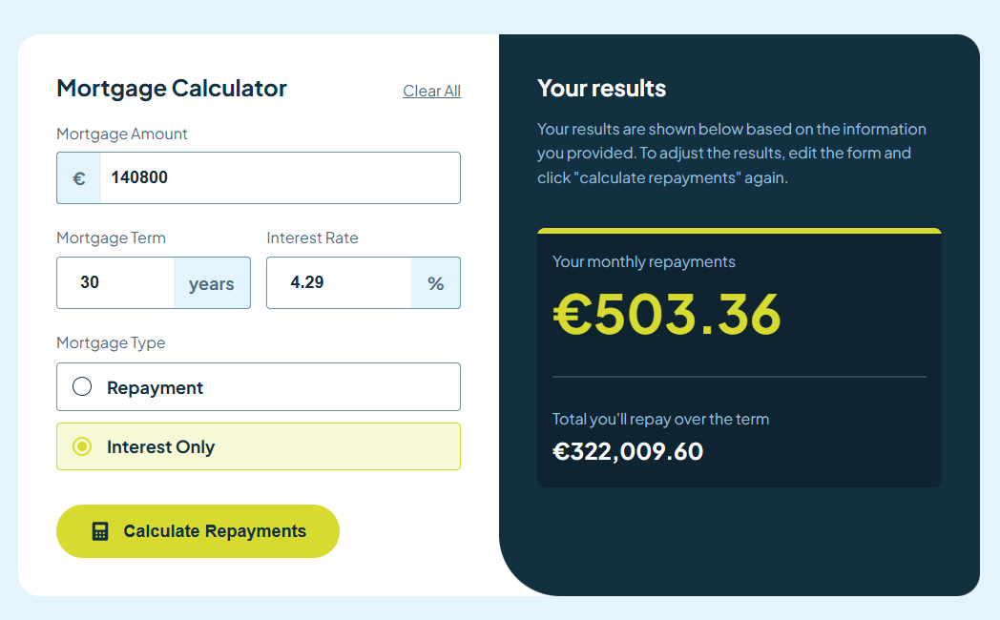
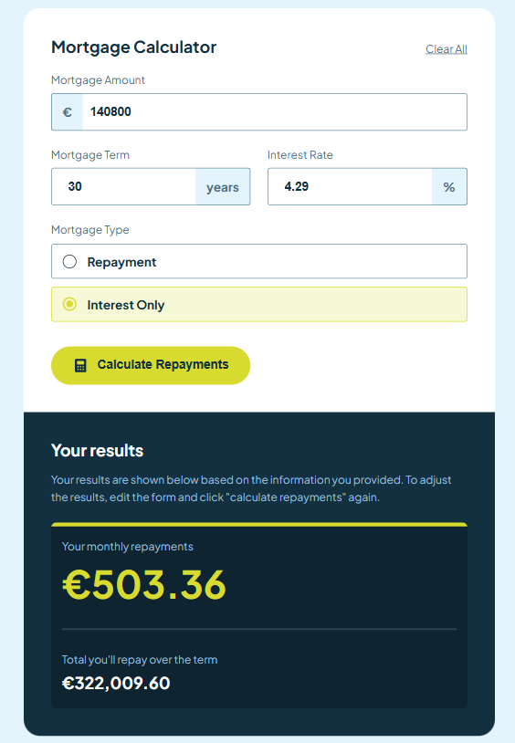
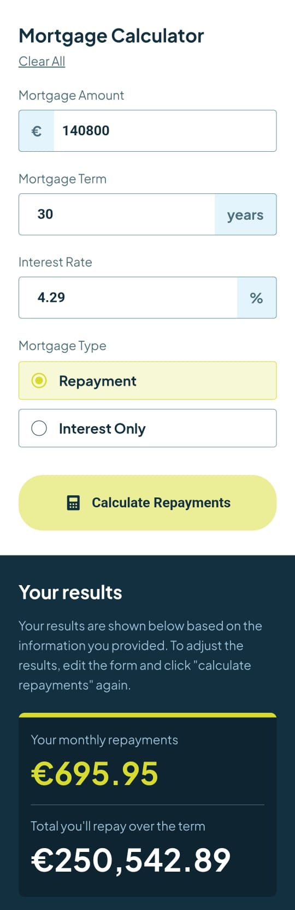

# Frontend Mentor - Product list with cart solution

This is a solution to the [Product list with cart challenge on Frontend Mentor](https://www.frontendmentor.io/challenges/product-list-with-cart-5MmqLVAp_d). Frontend Mentor challenges help you improve your coding skills by building realistic projects. 

## Table of contents

- [Overview](#overview)
  - [The challenge](#the-challenge)
  - [Screenshot](#screenshot)
  - [Links](#links)
- [My process](#my-process)
  - [Built with](#built-with)
  - [What I learned](#what-i-learned)
  - [Continued development](#continued-development)
  - [Useful resources](#useful-resources)
- [Author](#author)

## Overview

### The challenge

Users should be able to:

- Input mortgage information and see monthly repayment and total repayment amounts after submitting the form
- See form validation messages if any field is incomplete
- Complete the form only using their keyboard
- View the optimal layout for the interface depending on their device's screen size
- See hover and focus states for all interactive elements on the page

### Screenshot

### Links

- Solution URL: [GitHub](https://drakehermit-mortgage-calculator.netlify.app/)
- Live Site URL: [Live Site](https://drakehermit-mortgage-calculator.netlify.app/)

## My process

I always start with making the mobile first version and after that I started adding all the logic needed. After I was satisfied how the logic worked I finished it off with some minor improvements and added some quality of life features, and then topped it all off with making it responsive for both tablet and desktop devices.

### Built with

- Semantic HTML5 markup
- SCSS
- Flexbox
- CSS Grid
- Mobile-first workflow
- [React](https://reactjs.org/) - JS library

### What I learned

I learned a lot building out this project, and it was a great experience for me to build it out and fix all the bugs I came across. I learned a lot about managing state for input elements, how focused and error states worked. Also working with context again helped me understand the concept better. I also worked with scss for the first time and I actually enjoyed working with it.

### Continued development

My plan is to keep on improving my react knowledge, along with learning TS better. I want to start using tailwind since it's becoming a hassle to constantly switch between the component I'm working on and the css file.

## Author

- Frontend Mentor - [@DrakeHermit](https://www.frontendmentor.io/profile/DrakeHermit)